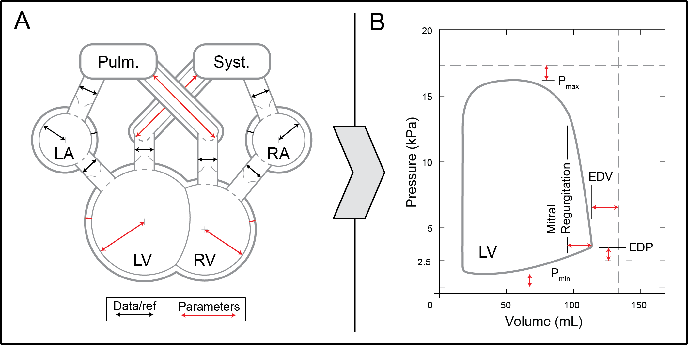

# CircOpt

CircOpt is an optimization framework for the tuning of patient/subject-specific circulatory models. It is implemented in Matlab and uses [CircAdapt](http://www.circadapt.org) for model evaluations.

Here is a figure showing the geometric parameters and objective metrics used in the circulatory optimization. (A) A schematic of the CircAdapt model highlighting key geometric dimensions of major model components. Non-geometric parameter tuning is also available in CircOpt. (B) A typical simulated left ventricular pressure-volume loop showing all partial objective metrics.

## Features
This project contains a number of features that support the automation of model tuning: 
* Patient/subject-specific data are organized in a configuration file. Missing values are updated from the reference values as well as possible through a rules-based system.
* Models are tuned from the reference configuration over a variable number of steps for stability. Failures detection stops diverging models early.
* Model parameters to be tuned are listed in a struct. The initialization of reference values and scaling is automatically handled.
* Models are evaluated in parallel during the optimization 
* Results are logged and queried to prevent duplicate model evaluations. 
* Left ventricular pressure-volume loops can be easily plotted for visual inspection.

## Dependencies
The core of the cardiovascular circulatory model is [CircAdapt](http://www.circadapt.org), which can be downloaded directly from their website.

This program also uses solvers from the [Matlab Optimization Toolbox](https://www.mathworks.com/products/optimization.html).

## Installation
1. Clone the CircOpt repository
2. Download CircAdapt and place it in worker0/
3. Manually modify CircAdapt as described in diff.txt

## Using CircOpt
1. Follow the example syntax in Run.m to tune a model
2. Change the values in 'data...m' (and make sure to reference that file in Run.m) to provide patient-specific data for tuning

## File Organization
* 'worker0/': Contains the template that will be cloned for each cpu worker at optimization runtime
* 'params...Ref.m': Contain reference and initialization data for a specific patient or subject species
* 'data...m': Contain data for a specific patient or subject
* 'opt...m': Tune CircAdapt to a specific patient or subject
* 'eval...m': Evaluate a given patient or subject CircAdapt configuration
* 'step...m': Evaluate a single perturbation step within a given patient or subject CircAdapt configuration

## Publications
1. Joshua Mineroff, Balaji Sesha Sarath Pokuri, Adarsh Krishnamurthy, and Baskar Ganapathysubramanian (In Review). Optimization Framework for Patient-Specific Modeling Under Uncertainty. _International Journal for Numerical Methods in Biomedical Engineering_
2. Joshua Mineroff, Andrew D. McCulloch, David Krummen, Baskar Ganapathysubramanian, and Adarsh Krishnamurthy (Accepted 2019). Optimization Framework for Patient-Specific Cardiac Modeling. _Cardiovascular Engineering and Technology_
3. Joshua Mineroff (2018). An Optimization and Uncertainty Quantification Framework for Patient-Specific Cardiac Modeling. _Graduate Theses and Dissertations_

## Licensing
This code is licensed under MIT license.
